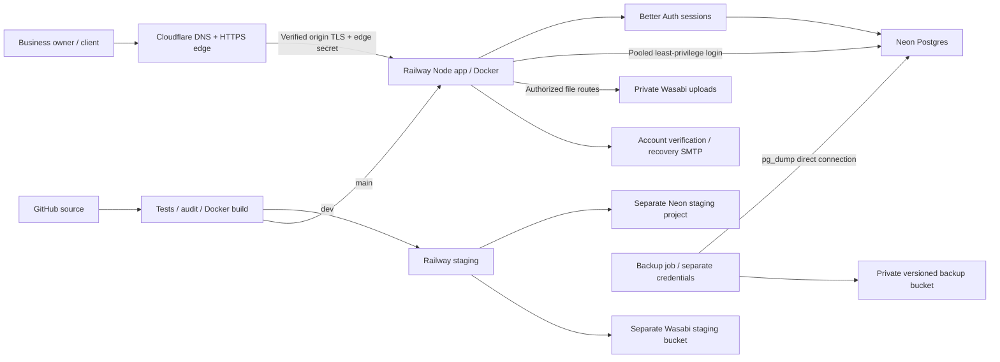

# EventDesk public deployment

The two Neon projects exist: staging `steep-mountain-61813886`, production
`sparkling-cell-16479473`, PostgreSQL 17, AWS us-west-2. Staging has synthetic
fixtures. Current provisioning and validation status is tracked in the readiness
report; this diagram describes the target, not proof that all services are live.

The app uses pooled connections (10 per instance) and serializable transactions
with bounded retries for guarded writes. Migration/backup credentials remain
separate from the runtime login. Drizzle defines the schema; versioned SQL includes
document helpers preserving historical quotes. Money remains integer cents.

Each record and object key retains its business ID. The current authenticated
workspace is owner-only. Staff roster records do not grant login access. Client
proposal tokens are restricted to that proposal. Adding staff login requires a
separate membership/role implementation and permission matrix.

The existing beta Sites deployment remains available during migration. Cutover
requires a verified data export, owner identity mapping, object checksums, and a
rollback drill. Public deployment is not a silent data conversion.

## Source and release controls

Protect `main` and `dev`; require Validate to pass and reviewed pull requests.
Create GitHub environments `staging` and `production` with separate credentials.
`dev` deploys to staging; `main` deploys to production after the same CI checks.
Configure the environment variable `DEPLOY_ENABLED=true` only after its resources
and secrets are present. This is a setup gate, not a recurring manual approval.
Disable independent Railway GitHub autodeploy when this workflow is enabled,
so it cannot race the migration gate. Never run migrations at every app startup.

GitHub environment secrets: DIRECT_DATABASE_URL, RAILWAY_TOKEN (project scoped).
Variables: RAILWAY_PROJECT_ID, RAILWAY_SERVICE_ID, RAILWAY_ENVIRONMENT_ID, APP_URL,
DEPLOY_ENABLED. Backup credentials/variables are listed in deployment-setup.md.
Railway runtime variables follow `.env.example`, but omit owner/backup credentials.

## Runtime boundaries

The build is stamped with its tested Git SHA. Release verification checks the
reported readiness SHA, not merely a 200 from an older deployment.

The custom Node entry overwrites identity/proxy headers, bounds request bodies,
checks write origins, adds request IDs/security headers and drains on SIGTERM.
`PROXY_MODE=cloudflare` requires an edge-injected secret and valid client IP.
The Railway public address is then rejected except health checks. Before the edge
is configured, direct mode conservatively groups proxy IPs for rate limiting.
Do not claim individual visitor quotas work through an unverified proxy chain.

Cloudflare: use proxied CNAME records pointing to the actual Railway custom-domain
targets, provision origin certificates first, then Full (strict). Never use
Flexible TLS. Add an edge request-header rule for the secret; keep it out of
responses and logs. Domain names and targets await user configuration.
